# System kliniki medycznej

### Opis aplikacji

Aplikacja przedstawia prosty system kliniki medycznej z podstawowymi funkcjonalnościami. Ma na celu wsparcie zarządzania operacjami i procesami placówki medycznej.

---

#### Zrealizowane cele:

- [x] [Utworzenie DPU](https://github.com/Pawel-Raciborski/system-kliniki-medycznej/tree/main/Koncepcja%20systemu/Diagramy%20przypadk%C3%B3w%20u%C5%BCycia)
- [x] [Podstawowe scenariusze](https://github.com/Pawel-Raciborski/system-kliniki-medycznej/blob/main/Koncepcja%20systemu/Scenariusze/System%20kliniki%20medycznej%20-%20scenariusze.pdf)
- [x] [Utworzenie diagramu związków encji](https://github.com/Pawel-Raciborski/system-kliniki-medycznej/blob/main/Koncepcja%20systemu/Diagram%20zwi%C4%85zk%C3%B3w%20encji/diagram_zwi%C4%85zk%C3%B3w_encji.png)

#### Podstawowe funkcjonalności w systemie:

- Rejestracja pacjenta
- Rejestracja pracowników
- Zarządzanie wizytami
  - wypisywanie recept(w tym wypisywanie lekarstw)
  - wypisywanie skierowań
  - umawianie wizyt(przez recepcjonistę lub pacjenta)
- Generowanie raportów
- Zarządzanie harmonogramem(lekarza, recepcjonisty)
- Realizacja wizyty
- Powiadomienia o nadchodzącej wizycie

---

### Architektura oprogramowania

Aplikacja monolityczna

### Wykorzystane technologie:

#### Front-end:

- Angular
- TypeScript
- CSS
- Bootstrap
- HTML5

#### Back-end:

- Java
- Spring Boot

#### Baza danych:

- PostgreSQL

#### Inne technologie:

- Postman
- Docker

# Działanie aplikacja i dostępne widoki

## Użytkownicy

W aplikacji możemy wyróżnić czterech użytkowników:

- `Lekarz` - odpowiedzialny za realizację wizyt, może przeglądać listę pacjentów, umawiać ich na wizyty. Ma dostęp do kalendarza swoich wizyt
- `Recepcjonista` - osoba odpowiedzialna za umawianie wizyt do lekarzy, może przeglądać listę pacjentów, ma dostęp do kalendarza wizyt lekarzy
- `Pacjent` - ma dostęp do swojej karty pacjenta, może przeglądać informacje o swoich chorobach oraz ich hospitalizacji, ma możliwość umawiania się na wizytę
- `Administrator` - podstawowa implementacja użytkownika administratora, może on przypisywać role do poszczególnych użytkowników, dodatkowo może dodawać, usuwać oraz modyfikować użytkowników

## Widoki aplikacji

Poniżej przedstawiono możliwe działania poszczególnych użytkowników

### Logowanie

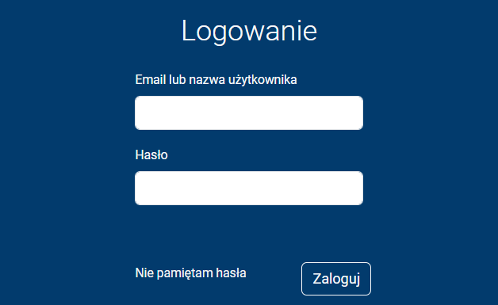

Jest to widok startowy, jaki widzi użytkownik przy przejściu do aplikacji. Przekazuje on tutaj swoje dane logowania, po kliknięciu przycisku `Zapisz` zostanie przekierowany na swój główny widok (w zależności od pełnionej roli).

### Rejestracja

Rejestracja odbywa się za pośrednictwem administratora. Jeżeli do kliniki medycznej zostaje przyjęty nowy pracownik tworzone jest dla niego konto.

#### Rejestracja lekarza

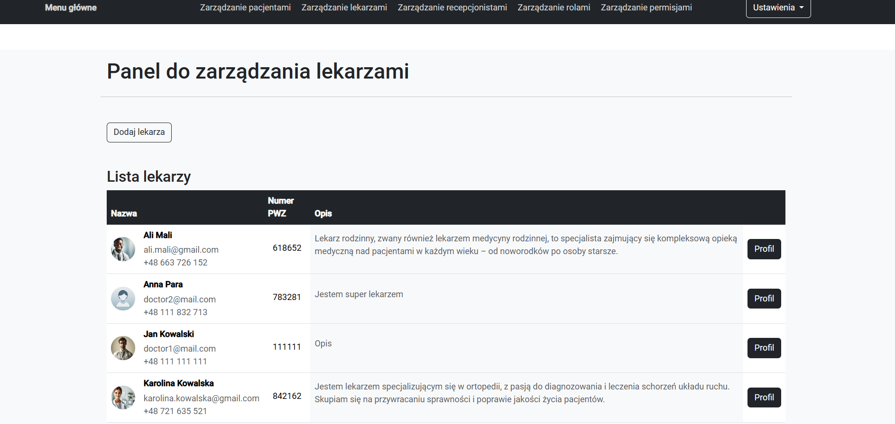

Administrator może zarejestrować lekarza znajdując się w panelu `Zarządzanie lekarzami`. Wyświetla się tutaj tabela z dostępnymi lekarzami. Dodawanie nowego lekarza odbywa się po wciśnięciu przycisku `Dodaj lekarza`. Wyświetla się poniższe okno dialogowe:

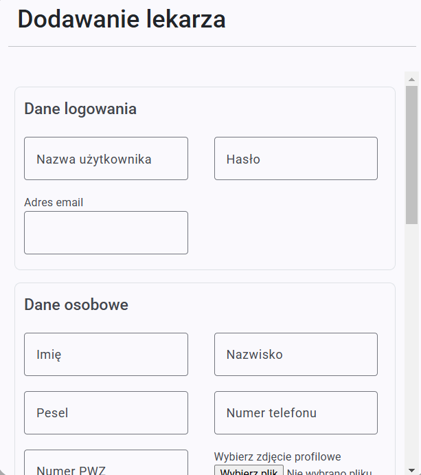
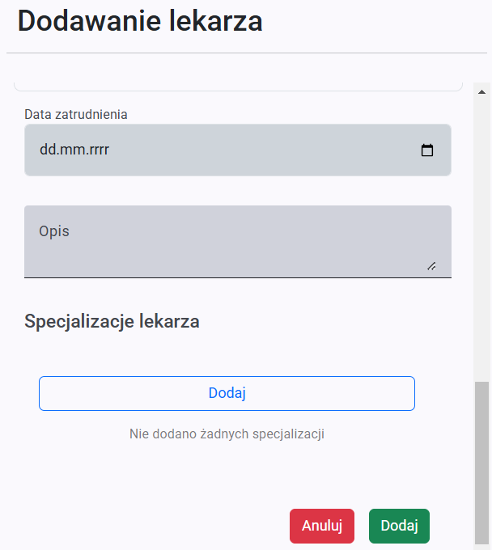

Podajemy tutaj podstawowe dane osobowe, dane do konta użytkownika, możemy opcjonalnie podać zdjęcie profilowe lekarza. Po kliknięciu przycisku `Dodaj` tworzony jest nowy lekarz.

#### Rejestracja recepcjonisty

Aby zarejestrować recepcjonistę administrator przechodzi do zakładki `Zarządzanie recepcjonistami`. Wyświetla się widok z tabelą recepcjonistów.

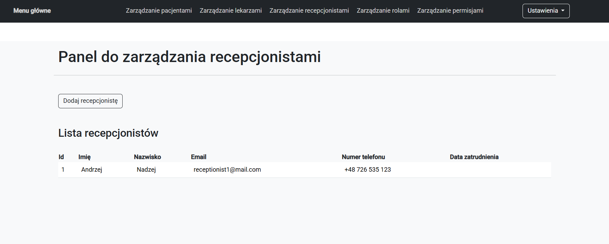

Po kliknięciu przycisku `Dodaj recepcjonistę` wyświetla się okno dialogowe:

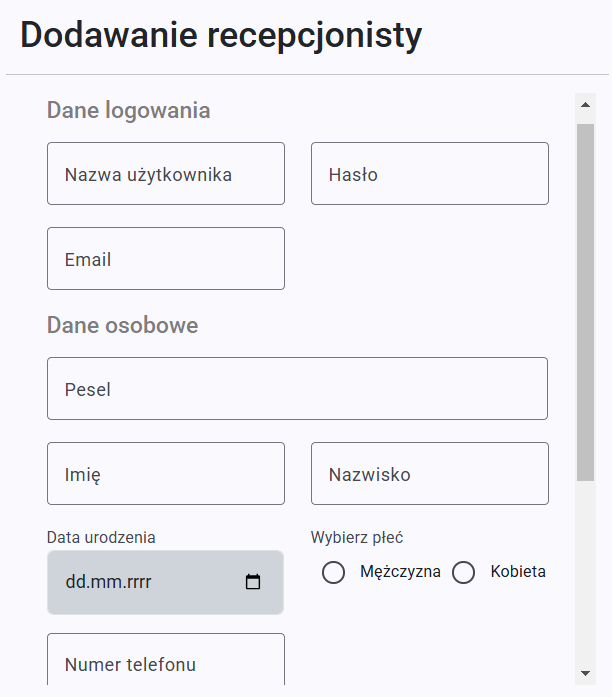

Podajemy tutaj dane recepcjonisty (dane konta, osobowe). Jeżeli dane są prawidłowe, klikamy przycisk `Dodaj` znajdujący się na samym końcu formularza.

#### Rejestracja pacjenta

Po przejściu do zakładki `Zarządzanie pacjentami` wyświetla się tabela z dostępną listą pacjentów:

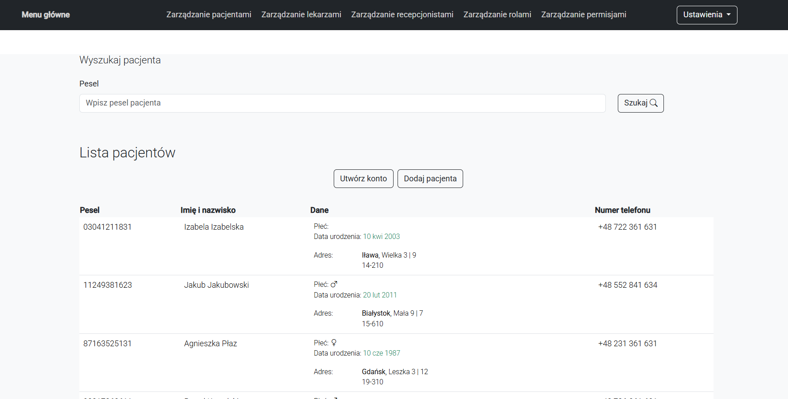

Mamy tutaj możliwość wyszukiwania pacjentów (górny panel), możemy przejści do profilu pacjenta klikając na dany rekord.

Możliwość rejestracji pacjenta umożliwia przycisk `Dodaj pacjenta`. Po jego kliknięciu wyświetla się następujące okno dialogowe:

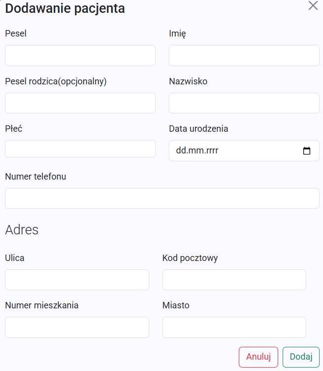

Pacjent taki zostaje zarejestrowany do systemu natomiast nie posiada on w dalszym ciągu konta - konto jest w jego przypadku **opcjonalne**. Jeżeli chcemy utworzyć konto pacjenta jest to możliwe poprzez drugi przycisk znajdujący się w panelu - `Utwórz konto`. Wyświetla się poniższe okno dialogowe:

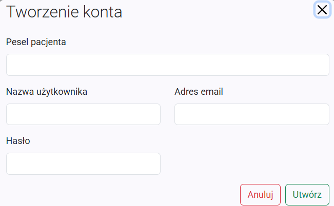

Podajemy tutaj podstawowe dane pacjenta i po wypełnieniu formularza klikamy przycisk `Utwórz`. Jeżeli dane są prawidłowe konto zostanie utworzone.

W przypadku rejestracji pacjenta może realizować to również recepcjonista oraz lekarz. Lekarz może zarejestrować dane osobowe pacjenta, tak samo jak recepcjonista ale dodatkowo recepcjonista ma możliwość utworzenia konta pacjenta. Okna dialogowe rejestracji są analogiczne do powyższych, natomiast jest zmieniony widok listy pacjentów, który jest następujący:

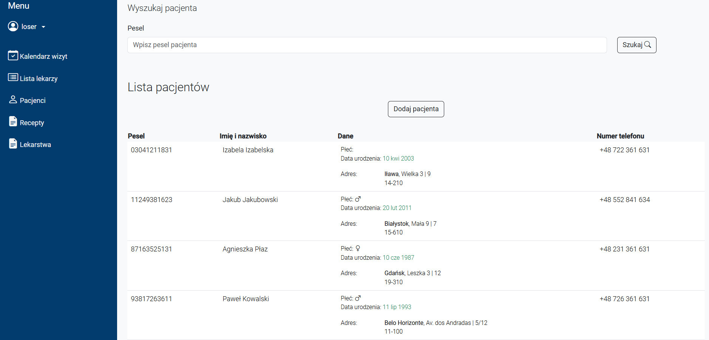

### Panel lekarza

Poniżej opisano podstawowe widoki dostępne dla lekarza:

#### Kalendarz wizyt

Jest to pierwszy widoczny widok lekarza po zalogowaniu. Przedstawia on kalendarz wizyt na aktualny tydzień pracy. Każda kolumna przedstawia dzień tygodnia, w kolumnie znajdują się posortowane po godzinie wizyty. Każda z wizyt posiada swój status (Umówiono, W trakcie, Zakończona, Anulowana, Potwierdzono).

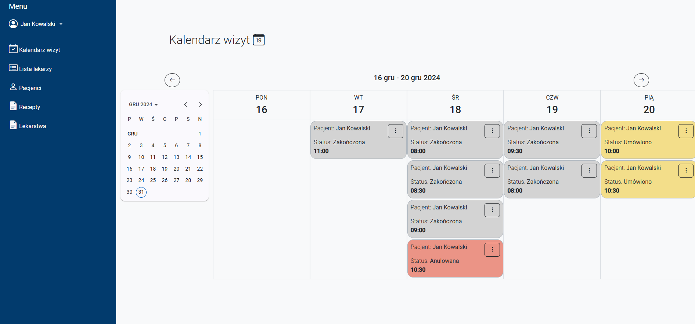

Lekarz może wyświetlić bardziej dokładnie informacje wizyty po wciśnięciu przycisku (prawy górny róg danej wizyty). W zależności od statusu wizyty widoczna jest inna informacja. Jeżeli status jest różny od `Potwierdzono` wyświetla nam się następujące okno dialogowe:

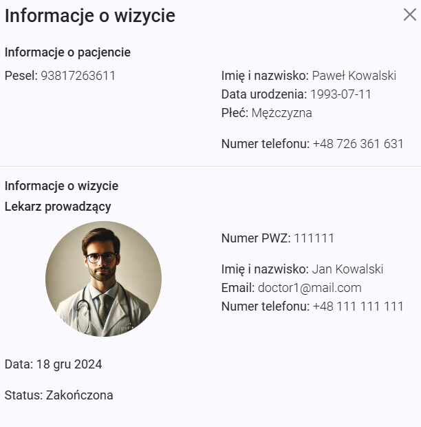

W przypadku statusu `Potwierdzono` oznacza to, że pacjent potwierdził swoją wizytę i może być ona realizowana. Po kliknięciu na taką wizytę przechodzimy do panelu głównego realizacji wizyty.

#### Realizacja wizyty

Jest to widok wyświetlany gdy wizyta posiada status jako `Potwierdzono`.

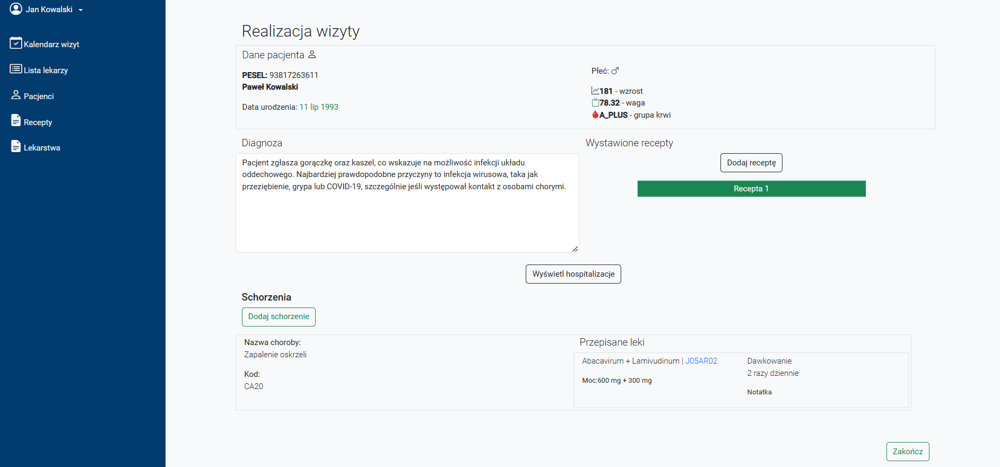

Widok reprezentuje realizację wizyty. Lekarz przeprowadzając swoje badania może na bieżąco stawiać diagnozę. Dodatkowo ma możliwość dodawania recept oraz schorzeń. Może też wyświetlić aktualne hospitalizacje, gdzie zostaną wyświetlone aktualne horoby.

Po kliknięciu przycisku `Dodaj receptę` wyświetla się następujące okno dialogowe:

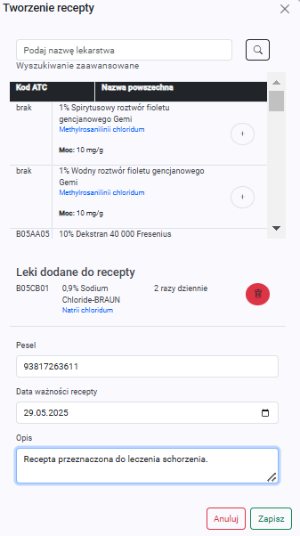

Lekarz może wyszukiwać tutaj poszczególne lekarstwa, oraz dodawać je na receptę konkretnego pacjenta. Dane o lekarstwach są wyszukiwane z RPL([Rejestru Produktów Leczniczych](https://rejestry.ezdrowie.gov.pl/rpl/search/public)). Po kliknięciu przycisku `Dodaj` recepta zostaje dodana.

Przycisk `Dodaj schorzenia` umożliwia na utworznie nowego schorzenia stwierdzonego w czasie diagnozy:

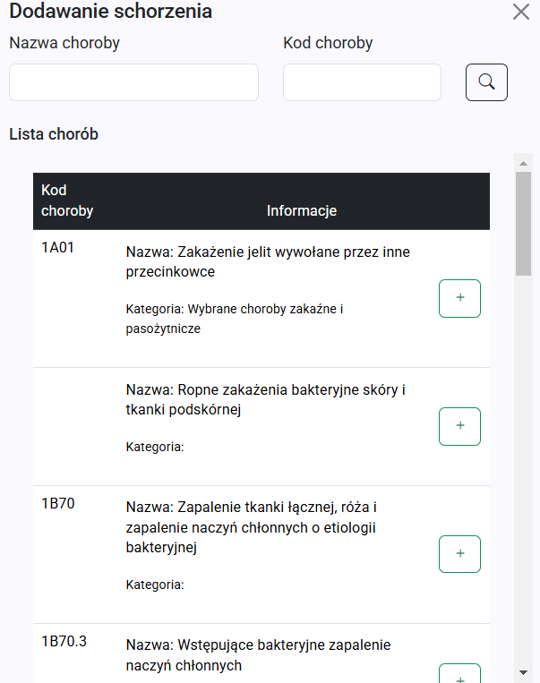

Wyświetlana jest lista chorób, lekarz może dodać daną chorobę po kliknięciu przycisku po prawej stronie rekordu z chorobą. Po jego kliknięciu wyświetla się kolejne okno dialogowe z dodaniem leczenia:

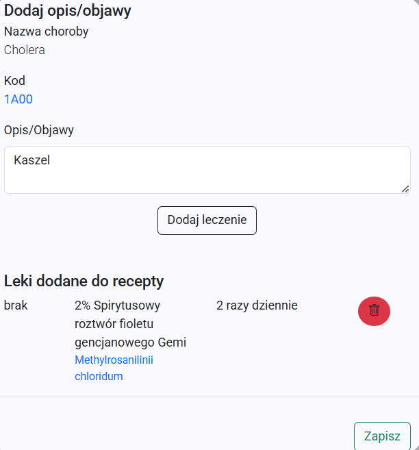

Lekarz przy kliknięciu przycisku `Dodaj leczenie` dodaje lekarstwa, które mają zwalczyć chorobę. Po kliknięciu przycisku `Zapisz` następuje zapis stwierdzonej choroby.

Kiedy wizyta dobiegnie końca, lekarz może ją zakończyć klikając przycisk `Zakończ`.

#### Recepty

Widok prezentuje listę recept przepisanych przez lekarzy. Każda z recept posiada informacje o przepisanych lekach, kto je przepisał oraz informacje pacjenta:

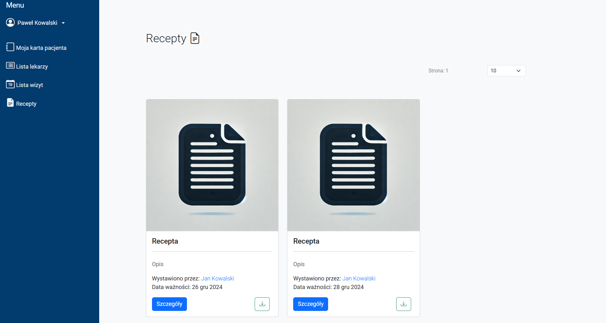

Recepty mogą być wyszukiwane poprzez pole tekstowe znajdujące się w górnej części(dostęp do niego posiada lekarz i recepcjonista):

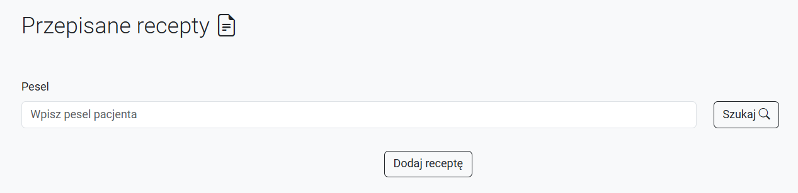

Powyższe pole umożliwia wyszukanie przepisanych recept dla konkretnego pacjenta.

Poniżej przedstawiono widok recepty, po kliknięciu pola `Szczegóły`. Wyświetla ona informacje o lekarzu, który przepisał receptę, dane pacjenta oraz listę przepisanych leków.

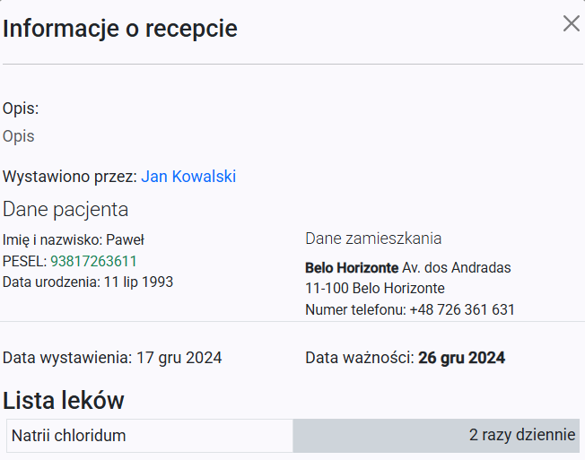

#### Lekarstwa

Widok wyświetlany po wybraniu z menu `Lekarstwa`.

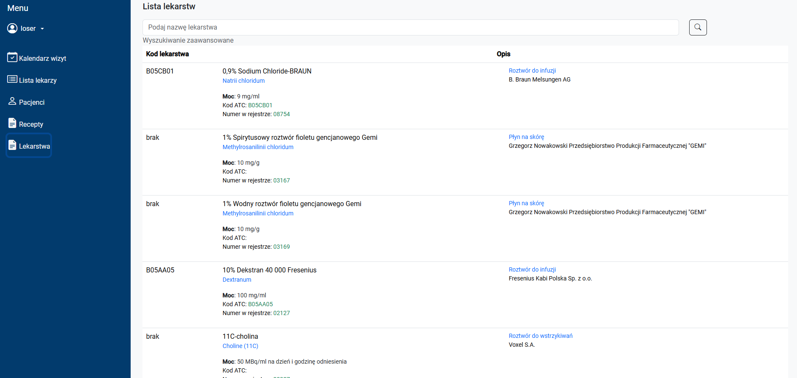

Widok przedstawia listę lekarstw oraz bardziej szczegółowe dane odnośnie lekarstw. Mamy możliwość wyszukiwania (oraz wyszukiwania zaawansowanego) lekarstw dostępnych w systemie [RPL](https://rejestry.ezdrowie.gov.pl/rpl/search/public).

#### Lista pacjnetów

Widok wyświetlany po kliknięciu `Pacjenci` w bocznym menu. Przedstawia on podstawowe informacje pacjenta. Mamy możliwość wyszukiwania pacjenta po numerze PESEL. Po kliknięciu na dany rekord pacjenta zostaniemy przkierowani do karty pacjenta:

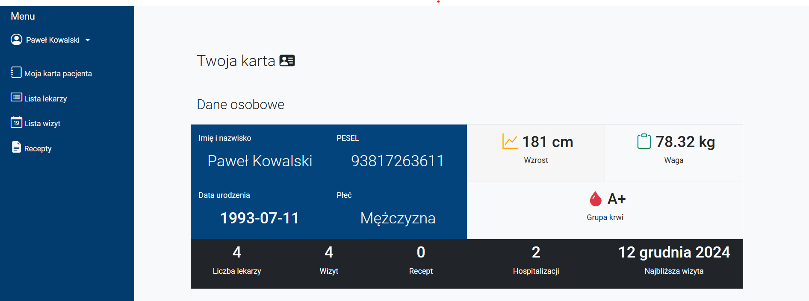

Widok reprezentuje informacje o pacjencie (imię nazwisko, pesel itd.) oraz parametry pacjenta (waga, wzrost, grupa krwi).

Poniżej tego panelu znajduje się lista aktualnie leczonych chorób:

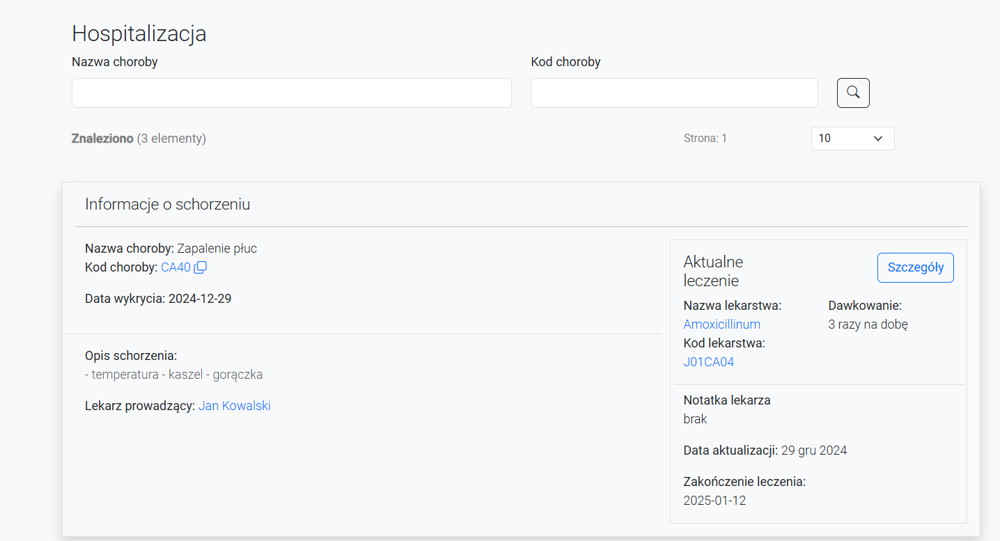

Klikając w szczegóły możemy wyświetlić historię hospitalizacji danej choroby - proces jej leczenia, to jakie leki były przepisywane oraz notatki pacjenta:

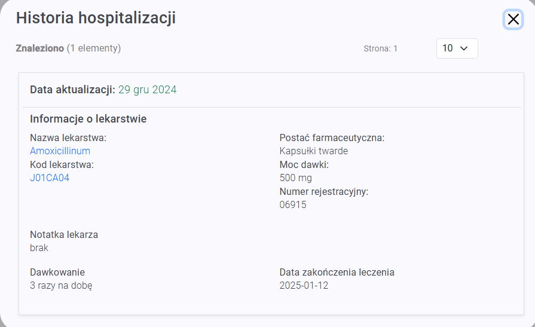

Lekarz ma możliwość edytowania informacji o leczeniu o ile nie zakończyło się leczenie.

Do powyższego widoku karty pacjenta ma dostęp także pacjent, jest to widok analogiczny.

#### Edytowanie profilu osobistego

Lekarz posiada możliwość edycji swojego profilu osobistego, gdzie może edytować swoje dane osobowe, dodać specjalizacje, a także swoje godziny pracy.

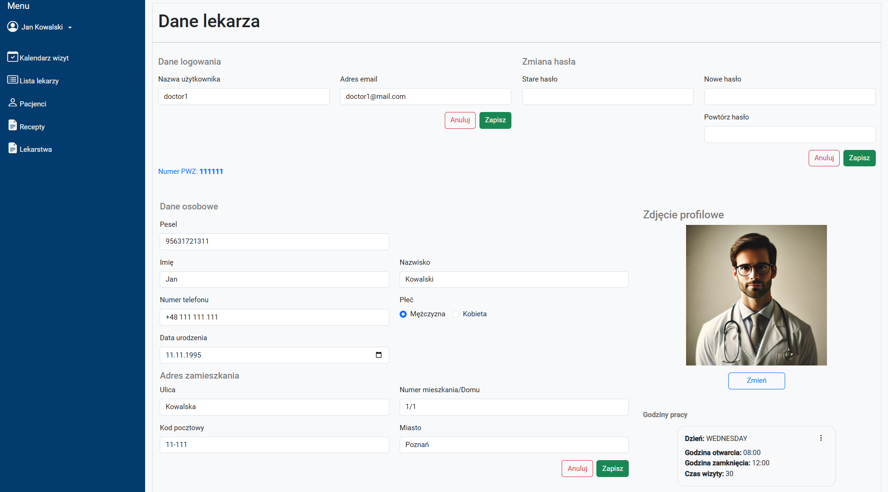

Po edycji i kliknięciu pola `Zapisz` informacje zostają zmienione.

Dodawanie godzin pracy umożliwia przycisk `Dodaj` znajdujacy się pod zdjeciem profilowym lekarza. Po jego kliknięciu wyświetla się okno dialogowe dodawania godzin pracy:

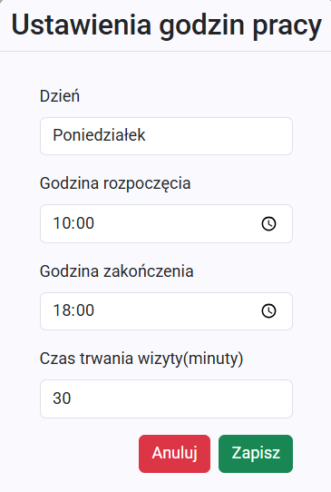

Wybieramy tutaj dzień pracy, który nas interesuje, godzinę rozpoczęcia pracy oraz zakończeni, potencjalny czas trwania wizyty w minutach. Po kliknięciu przycisku `Zapisz` godziny pracy zostają dodane. Jeżeli chcemy zmienić godziny pracy w każdym momencie możemy edytować konkretny dzień.

Jest to kluczowy element ze względu na to, że żeby móc zarejestrować się na wizytę lekarz musi określić swoje godziny pracy.

Poniżej danych osobowych znajduje się panel ze specjalizacjami lekarza, które może dodawać.

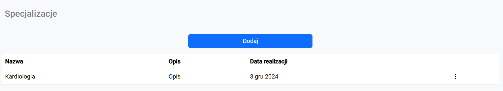

### Panel recepcjonisty

Głównym zadaniem recepcjonisty jest aktualizacja statusów wizyt oraz umawianie pacjentów na wizyty.

Panel recepcjonisty jest podobny do panelu lekarza, z pewnymi ograniczeniami. Menu recepcjonisty składa się z następujących elementów:

- `Lista lekarzy`
- `Wizyty`
- `Pacjenci`
- `Lekarstwa`

Różnica jaka występuje jest taka, że w przypadku recepcjonisty posiada on dostęp do kalendarza wizyt każdego lekarza:

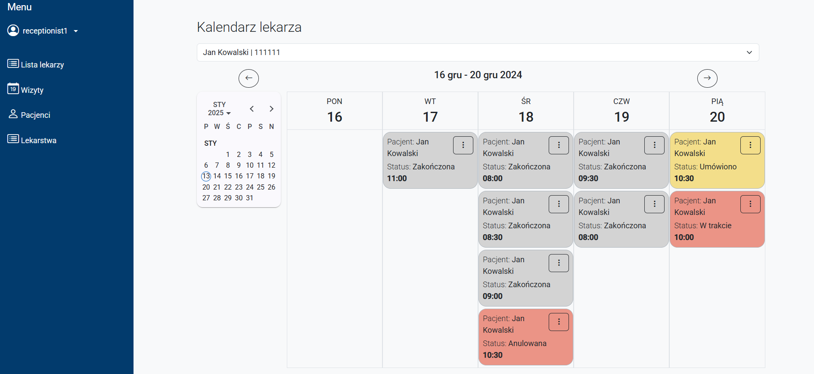

W górnym panelu recepcjonista może wybrać z listy rozwijalnej konkretnego lekarza, gdzie nastąpi załadowanie jego kalendarza wizyt.

Pozostałe dostępne widoki są analogiczne jak w przypadku lekarza.

### Panel pacjenta

Jest on dostępny gdy pacjent wyrazi chęci utworzenia konta w systemie, w przeciwnym wypadku dostęp do karty pacjenta posiada tylko lekarz oraz recepcjonista.

#### Karta pacjenta

Po zalogowaniu pierwszym widokiem jaki widzi pacjent jest **karta pacjenta**:

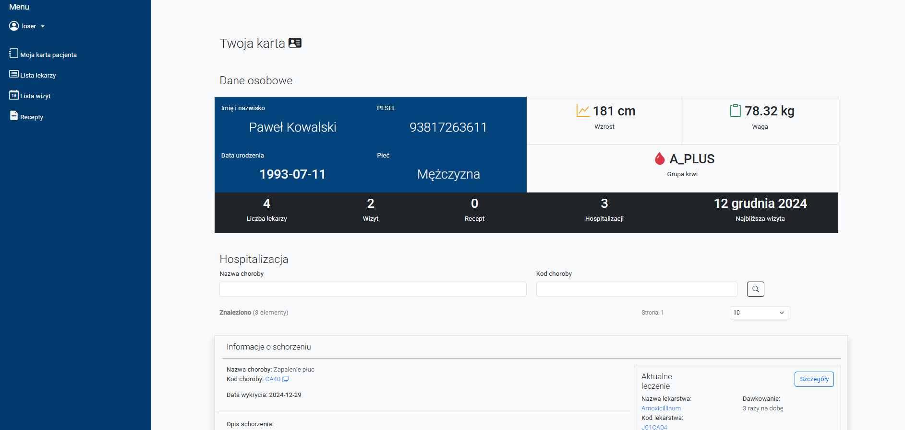

Informacje jakie są widoczne to dane osobowe, parametry pacjenta. Poniżej wyświetla się historia leczenia, gdzie pacjent może na bieżąco je przeglądać oraz stosować się do aktualnego leczenia.

#### Lista lekarzy

Jest to widok dostępny dla każdego użytkownika niezależnie od roli (pacjent, recepcjonista, lekarz, admin). Przedstawia on listę dostępnych lekarzy w klinice:

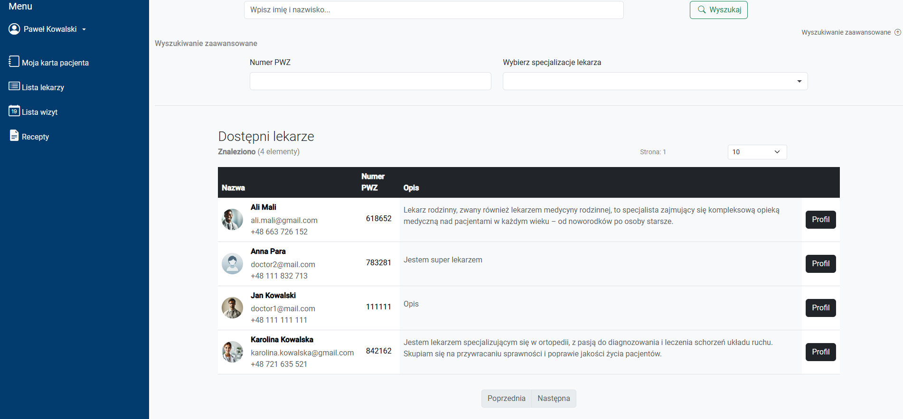

Widoczne są podstawowe informacje o lekarzu. Mamy możliwość wyszukiwania lekarzy po imieniu oraz nazwisku, przy wyszukiwaniu zaawansowanym możemy podać numer PWZ lekarza, oraz wyszukać lekarzy z konkretnymi specjalizacjami. Lista specjalizacji jest listą dynamiczną przechowującą specjalizacje zarejestrowanych lekarzy.

Klikając na przycisk `Profil` wyświetlimy profil lekarza:

Po kliknięciu na profil lekarza mamy możliwość umówienia się na wizytę do lekarza. Klikając przycisk `Umów na wizytę` wyświetli się okno dialogowe umożliwiające rejestrację na wizytę:

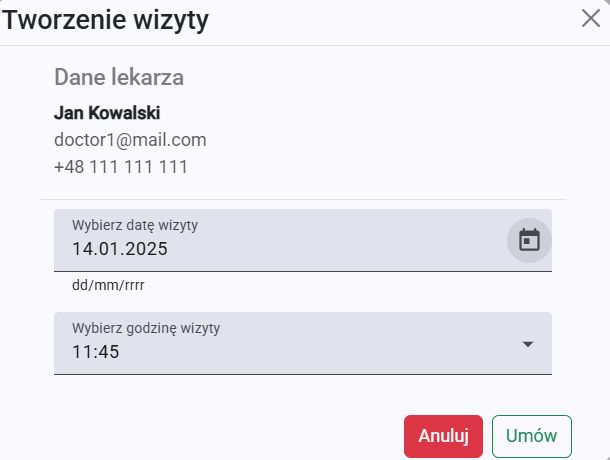
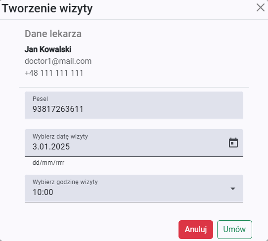

W zależności od tego czy rejestruje nas recepcjonista/lekarz, czy rejestruje się bezpośrednio pacjent, widoczne są różne pola. Z lewej strony jest to widok pacjenta, z prawej recepcjonisty oraz lekarza.

Wybieramy datę oraz godzinę wizyty. Data oraz godzina jest dynamicznie pobierania z serwera. Zarezerwowane godziny nie są wyświetlane.

W przypadku daty w zależności od określonych dni pracy mamy do wyboru tylko określone dni, to samo jest w przypadku godziny:

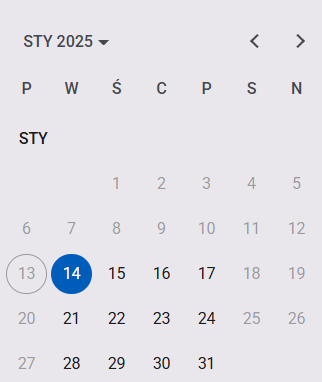
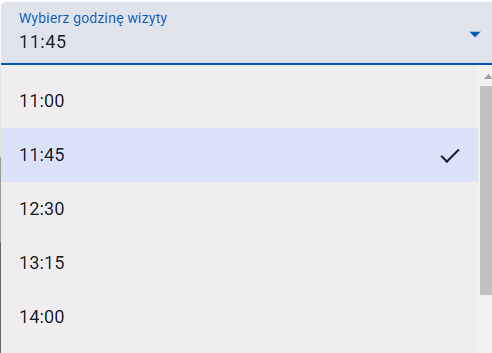

## Podsumowanie

Powyżej przedstawiono podstawowe widoki dostępne w aplikacji umożliwiające wykonywanie podstawowych funkcjonalności. Mamy dostęp do systemu z kilku perspektyw jej użytkowania, jak z poziomu lekarza, recepcjonisty, pacjenta czy administratora. Każdy z nich w zależności od pełnionej roli posiada różne możliwości - zarządzanie użytkownikami, tworzenie wizyt, realizacja wizyt, itp.

Nie zostały tutaj zaimplementowane wszystkie funkcjonalności ze względu na brak czasu. Funkcjonalności jakie chciałbym zaimplementować w przyszłości to:

- dodawanie skanów dokumentów medycznych (prześwietlenia, badania itp.) pacjenta
- wysyłanie powiadomienia do użytkownika o zbliżającej się wizycie
- zmiania GUI na bardziej estetyczne

Dziękuję za poświęcony czas przy przeglądaniu aplikacji.
